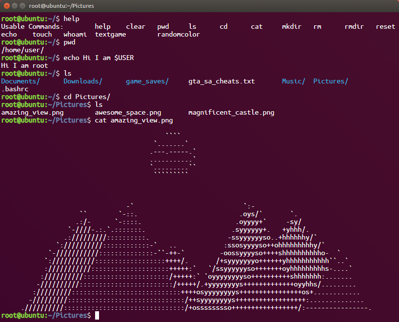

# React Terminal Simulator

A web-based terminal simulator built with React that provides an interactive Linux/Unix-like command-line interface in the browser.

  

## 📸 Screenshot



## ✨ Features

- Interactive terminal with command history and tab completion
- File system navigation (`ls`, `cd`, `pwd`, `cat`, `rm`, `clear`, `help`, `sudo`)
- File operations (`mkdir`, `rmdir`, `touch`, `echo`)
- System commands (`whoami`, `reset`, `history`)
- External utilities (`textgame`, `randomcolor`)
- **Persistent file system** - Changes saved to localStorage across sessions
- **Command history** - Navigate with ↑/↓ arrow keys
- **Fullscreen mode** - Click toolbar button or double-click to expand
- **Clipboard support** - Ctrl+C to copy, right-click to paste
- **Environment variables** - Basic substitution support ($USER, $HOSTNAME, $PWD)
- Touch device support
- Realistic bash-like behavior

## 🚀 Quick Start

```bash
git clone https://github.com/mustafacanp/react-terminal.git
cd react-terminal
npm install
npm start
```

Open [http://localhost:3000](http://localhost:3000) in your browser.

## 🎮 Usage

```bash
root@ubuntu:~/$ ls
Documents/  Downloads/  Music/  Pictures/  game_saves/  gta_sa_cheats.txt  .bashrc

root@ubuntu:~/$ cd Pictures
root@ubuntu:~/Pictures$ cat amazing_view.png
[File contents displayed]
```

Use ↑/↓ arrows for command history, Tab for completion.

## 🎨 Customization

### Environment Configuration

You can configure the terminal's `userName` and `computerName` by creating a `.env` file in the root of the project. Copy the example file and customize the values:

```bash
cp .env.example .env
```

Now, you can edit the `.env` file:

```
VITE_COMPUTER_NAME=your-pc
VITE_USER_NAME=your-name
VITE_BASE_PATH=home/user
```

### Theming

The terminal includes multiple themes to customize its appearance. You can change the active theme using the `theme` command.

**Usage:**

```bash
# List available themes
theme

# Set a new theme
theme set <theme_name>
```

**Available Themes:**

- `default`
- `matrix`
- `dracula`
- `dark`
- `cyberpunk`
- `monokai`
- `solarized`

The selected theme is automatically saved to your browser's local storage and will be remembered across sessions.

### Adding New Commands

To add a new command, extend the commands object in the `useTerminal` hook at `src/hooks/useTerminal.tsx`:

```typescript
// Inside the useTerminal hook
const commands = {
    // ... existing commands
    yourcommand: (input?: string) => {
        if (validateAndShowError(hasTooManyParameters(input || ''), 'yourcommand')) return;

        const param = getSecondParameter(input || '');
        // Command implementation using hook's state and helper functions
        cout('Your command output');

        // Update state if needed using functional setState
        setState(prev => ({
            ...prev
            // ... your state updates
        }));
    }
};
```

### Modifying File System

Edit `src/fs.json` to customize the virtual file system structure:

```json
{
    "type": "directory",
    "children": {
        "your_folder": {
            "type": "directory",
            "children": {}
        },
        "your_file.txt": {
            "type": "file",
            "src": "/path/to/file/content.txt"
        }
    }
}
```

## 🔗 Demo

Try it live: [https://mustafacanpalaz.com/cmd](https://mustafacanpalaz.com/cmd)

## 📝 License

MIT License - see [LICENSE](LICENSE) file.

---

Built with ❤️ using React

Copyright (c) 2025 Mustafa Can Palaz

## Testing

This project uses [Playwright](https://playwright.dev/) for comprehensive end-to-end testing across multiple browsers and devices. The test suite covers:

### Test Categories

#### 🖥️ **Basic Functionality** (`tests/terminal-basic.spec.ts`)

- Terminal loading and initialization
- Basic command execution (help, pwd, ls, clear)
- Error handling for unknown commands
- Focus management and keyboard interactions
- Right-click context menu prevention

#### 🧭 **Navigation Features** (`tests/terminal-navigation.spec.ts`)

- Directory navigation with `cd` command
- Tab completion for files and directories
- Command history navigation with arrow keys
- Complex file path handling
- Keyboard shortcuts and input validation

#### 📂 **File Operations & Commands** (`tests/terminal-commands.spec.ts`)

- File reading with `cat` command
- `sudo` command functionality
- Permission handling
- Parameter validation
- External link commands (`textgame`, `randomcolor`)
- File system simulation

#### 📱 **Mobile Responsiveness** (`tests/terminal-mobile.spec.ts`)

- Touch interactions and virtual keyboard
- Mobile viewport optimization
- Orientation change handling
- Performance on mobile devices
- Long press behavior and rapid touch inputs

#### 📊 **Tablet Responsiveness** (`tests/terminal-tablet.spec.ts`)

- Tablet screen space utilization
- Touch and keyboard input combinations
- Tablet-specific gestures
- Performance optimization for larger screens

### Browser Coverage

Tests run across multiple browsers and devices:

- **Desktop**: Chrome, Firefox, Safari (WebKit)
- **Mobile**: Chrome Mobile, Safari Mobile
- **Tablet**: iPad Pro simulation

### Running Tests

#### Install Dependencies

```bash
npm install
npx playwright install
```

#### Test Commands

```bash
# Run all tests
npm test

# Run tests with browser UI (headed mode)
npm run test:headed

# Run tests with Playwright Test UI
npm run test:ui

# Debug tests step by step
npm run test:debug

# Run specific test file
npx playwright test terminal-basic.spec.ts

# Run tests for specific browser
npx playwright test --project=chromium

# Run tests in parallel
npx playwright test --workers=4
```

### Test Structure

Each test file follows a consistent pattern:

```typescript
test.describe('Feature Category', () => {
    test.beforeEach(async ({ page }) => {
        await page.goto('/');
        await page.waitForLoadState('networkidle');
    });

    test('should perform specific action', async ({ page }) => {
        const promptInput = page.locator('.prompt-input');
        await promptInput.fill('command');
        await promptInput.press('Enter');
        await expect(page.locator('.terminal-body')).toContainText('expected output');
    });
});
```

### CI/CD Integration

Tests automatically run on:

- Pull requests to `main`/`master` branches
- Pushes to `main`/`master` branches

GitHub Actions workflow includes:

- Multi-browser testing
- Test artifact collection
- HTML reports generation
- Failure screenshots and videos

### Test Configuration

Key configuration options in `playwright.config.ts`:

- **Base URL**: `http://localhost:3000` (Vite dev server)
- **Retries**: 2 retries on CI, 0 locally
- **Parallel execution**: Enabled for faster test runs
- **Screenshots**: Captured on failure
- **Videos**: Recorded on failure
- **Traces**: Collected on retry

### Test Reports

After running tests, view the HTML report:

```bash
npx playwright show-report
```

The report includes:

- Test results across all browsers
- Failure screenshots and videos
- Performance metrics
- Trace viewer for debugging

### Writing New Tests

When adding new features:

1. **Choose the appropriate test file** based on functionality
2. **Follow existing patterns** for consistency
3. **Use descriptive test names** starting with "should"
4. **Include proper assertions** with meaningful error messages
5. **Test error conditions** as well as success cases
6. **Consider mobile/tablet behavior** for UI changes

### Test Debugging

For debugging failing tests:

```bash
# Debug mode - opens browser and pauses on failures
npm run test:debug

# Run specific test with debug
npx playwright test --debug -g "test name"

# Generate trace for specific test
npx playwright test --trace on terminal-basic.spec.ts
```

### Performance Testing

The test suite includes performance assertions:

- Command execution response times
- Auto-scroll behavior validation
- Mobile device performance benchmarks
- Memory usage monitoring

Tests ensure the terminal remains responsive across all supported devices and browsers.
