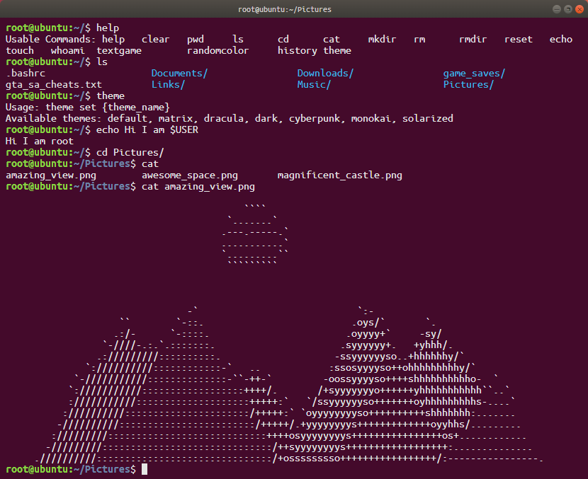

# React Terminal Simulator

A web-based terminal simulator built with React that provides an interactive Linux/Unix-like command-line interface in the browser.

  

## 📸 Screenshot



## ✨ Features

- Interactive terminal with command history and tab completion
- File system navigation (`ls`, `cd`, `pwd`, `cat`, `rm`, `clear`, `help`, `sudo`)
- Right-click to copy selected text
- Touch device support
- Realistic bash-like behavior

## 🚀 Quick Start

```bash
git clone https://github.com/mustafacanp/react-terminal.git
cd react-terminal
npm install
npm start
```

Open [http://localhost:3000](http://localhost:3000) in your browser.

## 🎮 Usage

```bash
root@ubuntu:~/$ ls
Documents/  Downloads/  Music/  Pictures/  game_saves/  gta_sa_cheats.txt  .bashrc

root@ubuntu:~/$ cd Pictures
root@ubuntu:~/Pictures$ cat profile.png
[File contents displayed]
```

Use ↑/↓ arrows for command history, Tab for completion.

## 🎨 Customization

### Adding New Commands

To add a new command, extend the commands object in `src/commands/terminalCommands.js`:

```javascript
export const createTerminalCommands = context => {
	const {
		getState,
		setState,
		cout
		// ... other context properties
	} = context;

	return {
		// ... existing commands
		yourcommand: (sudo, input) => {
			const state = getState(); // Get current state
			// Command implementation
			cout('Your command output');
			// Update state if needed
			setState({
				/* new state */
			});
		}
	};
};
```

### Modifying File System

Edit `src/fs.json` to customize the virtual file system structure:

```json
{
	"type": "directory",
	"children": {
		"your_folder": {
			"type": "directory",
			"children": {}
		},
		"your_file.txt": {
			"type": "file",
			"src": "/path/to/file/content.txt"
		}
	}
}
```

## 🔗 Demo

Try it live: [https://mustafacanpalaz.com/cmd](https://mustafacanpalaz.com/cmd)

## 📝 License

MIT License - see [LICENSE](LICENSE) file.

---

Built with ❤️ using React

Copyright (c) 2025 Mustafa Can Palaz
